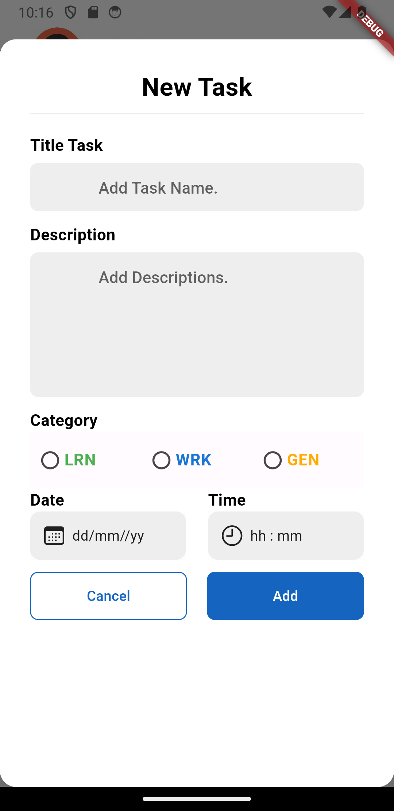
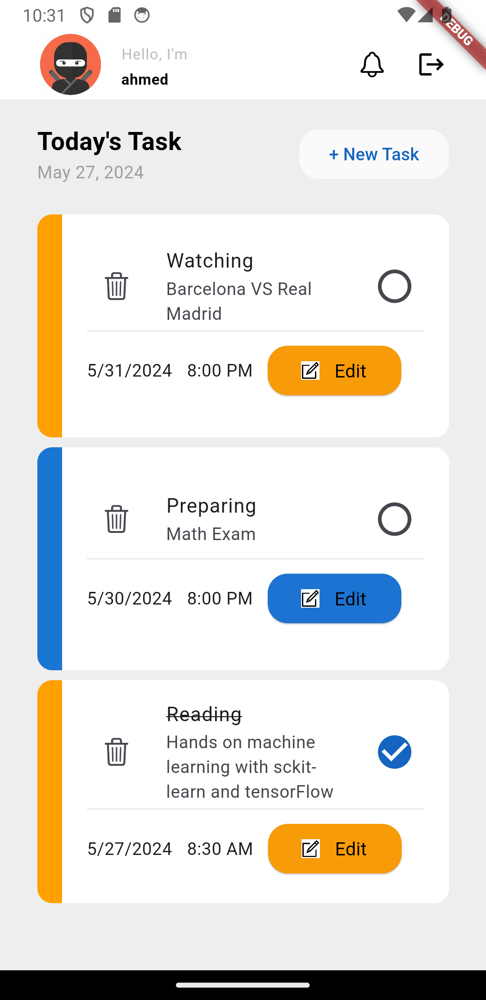
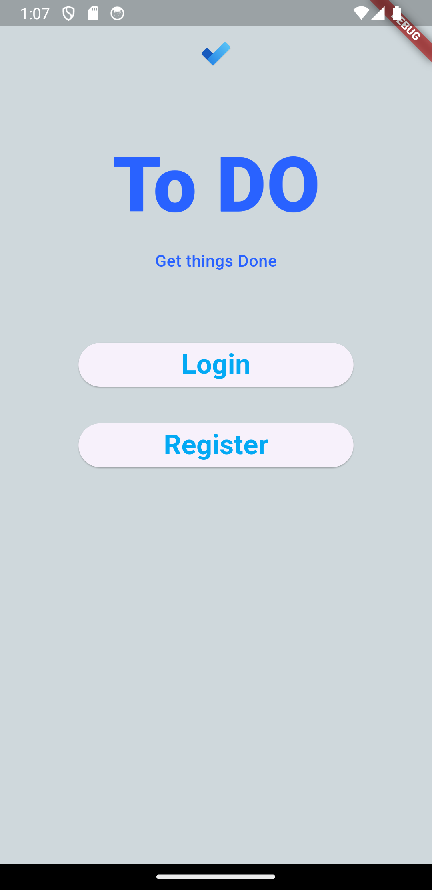

# ✔️ Flutter to do App "To Do List"

This is a simple and powerful To-Do List application built using Flutter. The app allows users to create, manage, and track their to-do items with ease. It leverages Firebase for authentication and data storage, and utilizes Riverpod for state management.  

## Features

- User authentication with Firebase
- Real-time data synchronization with Firestore
- State management using Riverpod
- Clean and modern UI with Cupertino Icons
- Unique ID generation for tasks using UUID
- Localization support with `intl` 

## Usage 
-Sign Up / Sign In: Users can sign up or sign in using their email and password.

-Add Tasks: Users can add new tasks with a title and optional description.

-Edit Tasks: Users can edit existing tasks.

-Delete Tasks: Users can delete tasks that are no longer needed.

-View Tasks: Users can view all their tasks in a list format. 

This project is licensed under the MIT License. See the [LICENSE](LICENSE) file for details.

